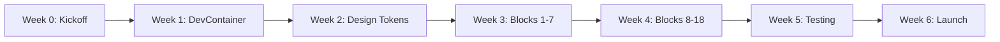
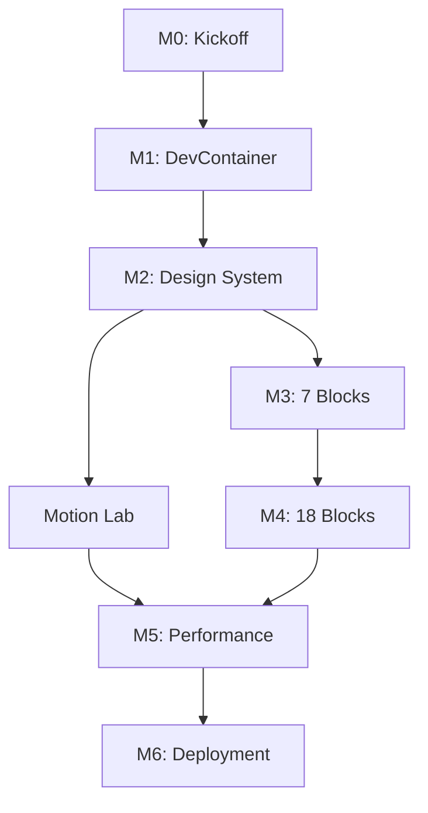

/**
 * Path: /KINETIK-OS-PROJECT-ROADMAP.md
 * Filename: KINETIK-OS-PROJECT-ROADMAP.md | Version: v7.8.0
 * Agent: Kinetik-OS (Lead: DevOps-V / Architect-K / DX-Curator)
 * Status: PRODUCTION CANONICAL
 * Logic: Complete project roadmap with phases, milestones, dependencies, and timelines
 */

# KINETIK-OS PROJECT ROADMAP

**Project:** Westport Partners - Boutique Federal Design System  
**Version:** 7.8.0  
**Roadmap Owner:** DevOps-V  
**Last Updated:** May 04, 2026  
**Status:** APPROVED FOR EXECUTION  
**Timeline:** 6 Weeks (42 Days)  
**Target Launch:** June 16, 2026

---

## EXECUTIVE SUMMARY

### Timeline Overview

```
Week 0: Preparation & Kickoff (May 4-8, 2026)
Week 1: Foundation & Infrastructure (May 11-15, 2026)
Week 2: Design System & Core Components (May 18-22, 2026)
Week 3: Block Library Development (Part 1) (May 25-29, 2026)
Week 4: Block Library Development (Part 2) (June 1-5, 2026)
Week 5: Motion, Testing & Optimization (June 8-12, 2026)
Week 6: Production Deployment & Launch (June 15-16, 2026)
```

### Critical Path



### Key Milestones

| Milestone | Target Date | Status | Dependencies |
|-----------|-------------|--------|--------------|
| **M0: Project Kickoff** | May 4, 2026 | ✅ Done | Stakeholder approval |
| **M1: DevContainer Operational** | May 15, 2026 | ✅ Done | None |
| **M2: Design System Complete** | May 22, 2026 | ✅ Done | M1 |
| **M2.5: Compositional Layout Builder** | May 25, 2026 | ✅ Done | M2 |
| **M3: 7 Blocks Functional** | May 29, 2026 | ✅ Done | M2.5 |
| **M4: 18 Blocks Complete** | June 5, 2026 | 🟡 Partially Complete (Motion/Bento pending) | M3 |
| **M5: Performance Targets Met** | June 12, 2026 | ⏳ Pending | M4 |
| **M6: Production Deployment** | June 16, 2026 | ⏳ Pending | M5 |

---

## WEEK 0: PREPARATION & KICKOFF (MAY 4-8, 2026)

### Overview

**Duration:** 5 days  
**Lead Agent:** DevOps-V + Architect-K  
**Goal:** Finalize scope, approve documentation, prepare infrastructure

### Day 0-1: Documentation Review & Approval

**Owner:** All Agents  
**Deliverables:**
- [ ] PRD approved by stakeholders
- [ ] Project Roadmap approved
- [ ] Project Rules ratified
- [ ] Agent roles assigned to team members

**Activities:**
- Stakeholder review meeting (2 hours)
- Technical feasibility review (1 hour)
- Risk assessment workshop (1 hour)
- Final scope lock

**Success Criteria:**
- ✅ All stakeholders sign PRD
- ✅ All agents confirm role understanding
- ✅ No open questions in PRD Section 9.1

### Day 2-3: AWS Account Setup

**Owner:** DevOps-V + Security-S  
**Deliverables:**
- [ ] AWS account configured
- [ ] IAM roles and policies created
- [ ] ECR repository created
- [ ] ECS cluster provisioned
- [ ] EFS file system created
- [ ] Route 53 hosted zone configured

**Activities:**
- AWS account audit and setup
- Security baseline implementation
- Infrastructure-as-Code templates (Terraform/CloudFormation)
- Billing alerts configured

**Success Criteria:**
- ✅ AWS CLI access verified
- ✅ ECR repository accepts image push
- ✅ IAM roles follow least-privilege principle
- ✅ Billing alerts set at $100, $500, $1000

### Day 4-5: Development Environment Preparation

**Owner:** DevOps-V  
**Deliverables:**
- [ ] Rancher Desktop installed on dev machines
- [ ] VS Code with required extensions
- [ ] Git repository initialized
- [ ] Branch protection rules configured
- [ ] CI/CD pipeline skeleton created

**Activities:**
- Developer workstation setup
- Git workflow training
- Pre-commit hook installation
- GitHub Actions workflow templates

**Success Criteria:**
- ✅ All developers can run Rancher Desktop
- ✅ Git repository accessible to team
- ✅ Pre-commit hooks execute successfully
- ✅ CI/CD pipeline runs on push

**Milestone:** **M0: Project Kickoff Complete** ✅

---

## WEEK 1: FOUNDATION & INFRASTRUCTURE (MAY 11-15, 2026)

### Overview

**Duration:** 5 days  
**Lead Agent:** DevOps-V  
**Goal:** Working DevContainer with Kirby, Vite, and HMR functional

### Day 1-2: DevContainer Configuration

**Owner:** DevOps-V  
**Deliverables:**
- [ ] `.devcontainer/devcontainer.json` created
- [ ] `Dockerfile` (development) created
- [ ] PHP 8.4-FPM installed with all extensions
- [ ] Node 24 LTS installed
- [ ] Composer and npm configured
- [ ] Port forwarding (8000, 3000) working

**Technical Tasks:**
```dockerfile
# Dockerfile highlights
FROM php:8.4-fpm
RUN apt-get update && apt-get install -y \
    libgd-dev libzip-dev libicu-dev \
    libexif-dev curl git
RUN docker-php-ext-install gd zip intl exif opcache
# Install Node 24 LTS via nodesource
RUN curl -fsSL https://deb.nodesource.com/setup_24.x | bash -
RUN apt-get install -y nodejs
# Install Composer
COPY --from=composer:latest /usr/bin/composer /usr/bin/composer
```

**Success Criteria:**
- ✅ Container builds in < 5 minutes
- ✅ `php -v` returns 8.4.x
- ✅ `node -v` returns 24.x
- ✅ `composer --version` works
- ✅ VS Code reopens in container successfully

### Day 3: Kirby Installation

**Owner:** Architect-K  
**Deliverables:**
- [ ] Kirby 5.4 Plainkit installed
- [ ] `public/index.php` with custom roots
- [ ] `site/config/config.php` created
- [ ] `.htaccess` security rules implemented
- [ ] Kirby Panel accessible at `/panel`

**Technical Tasks:**
```bash
# Install Kirby via Composer
composer create-project getkirby/plainkit temp
mv temp/kirby ./kirby
rm -rf temp

# Create custom index.php with roots
php -r "echo file_get_contents('template-index.php');" > public/index.php
```

**Success Criteria:**
- ✅ http://localhost:8000 shows Kirby welcome
- ✅ http://localhost:8000/panel loads
- ✅ Panel account creation works
- ✅ File permissions correct (www-data:www-data)

### Day 4: Vite 6 Setup

**Owner:** DevOps-V + DX-Curator  
**Deliverables:**
- [ ] `package.json` with all dependencies
- [ ] `vite.config.js` with Kirby plugin
- [ ] `src/main.js` created
- [ ] `src/index.css` created
- [ ] HMR working across ports

**Technical Tasks:**
```bash
npm install vite@^6.0.0 @tailwindcss/vite vite-plugin-kirby
npm install alpinejs gsap lenis
npm install -D @playwright/test vitest
```

**vite.config.js:**
```javascript
import { defineConfig } from 'vite';
import tailwindcss from '@tailwindcss/vite';
import kirby from 'vite-plugin-kirby';

export default defineConfig({
  plugins: [tailwindcss(), kirby()],
  server: {
    host: '0.0.0.0',
    port: 3000,
    hmr: { clientPort: 3000 },
    watch: { usePolling: true },
    origin: 'http://localhost:3000',
    cors: true
  },
  build: {
    outDir: './public/dist',
    manifest: true,
    rollupOptions: { input: 'src/main.js' }
  }
});
```

**Success Criteria:**
- ✅ `npm run dev` starts Vite on port 3000
- ✅ Editing `src/index.css` triggers HMR
- ✅ Editing PHP snippets triggers page reload
- ✅ No CORS errors in console

### Day 5: PHP-Vite Integration

**Owner:** Architect-K + DevOps-V  
**Deliverables:**
- [ ] `arnoson/kirby-vite` Composer package installed
- [ ] `site/snippets/header.php` with vite() helper
- [ ] `site/templates/default.php` created
- [ ] Test page renders with Vite assets

**Technical Tasks:**
```bash
composer require arnoson/kirby-vite
```

**header.php:**
```php
<?php
/**
 * Path: /site/snippets/header.php
 * Filename: header.php | Version: v7.8.0
 * Agent: Architect-K
 * Status: Production
 * Logic: Global header with Vite asset integration
 */
?>
<!DOCTYPE html>
<html lang="en">
<head>
  <meta charset="UTF-8">
  <meta name="viewport" content="width=device-width, initial-scale=1.0">
  <title><?= $page->title() ?></title>
  <?= vite()->css('src/index.css') ?>
  <?= vite()->js('src/main.js') ?>
</head>
<body>
```

**Success Criteria:**
- ✅ Vite assets load on page
- ✅ Tailwind utilities render correctly
- ✅ Alpine.js initializes (check console)
- ✅ GSAP loads without errors

**Milestone:** **M1: DevContainer Operational** ✅

---

## WEEK 2: DESIGN SYSTEM & CORE COMPONENTS (MAY 18-22, 2026)

### Overview

**Duration:** 5 days  
**Lead Agent:** DX-Curator + Architect-K  
**Goal:** Complete Tailwind token system and BoutiqueBridge implementation

### Day 1-2: Tailwind 4 Token System

**Owner:** DX-Curator  
**Deliverables:**
- [ ] `src/index.css` with complete @theme
- [ ] Color palette (Oceanic + accents)
- [ ] Airy spacing scale
- [ ] Typography scale
- [ ] Font families defined
- [ ] Token documentation

**Technical Tasks:**
```css
/* src/index.css */
@import "tailwindcss";

@source "../site/**/*.php";
@source "../content/**/*.txt";

@theme {
  /* Colors */
  --color-oceanic-dark: #005B6D;
  --color-oceanic-accent: #007489;
  --color-warm-gold: #D4C19C;
  --color-ink: #0F151B;
  --color-canvas: #FAF9F6;
  
  /* Spacing */
  --spacing-airy-sm: 2rem;
  --spacing-airy-md: 4rem;
  --spacing-airy-lg: 6rem;
  --spacing-airy-xl: 10rem;
  --spacing-airy-2xl: 14rem;
  --spacing-airy-massive: 20rem;
  
  /* Typography */
  --font-size-xs: 0.75rem;
  --font-size-sm: 0.875rem;
  --font-size-base: 1rem;
  --font-size-lg: 1.125rem;
  --font-size-xl: 1.25rem;
  --font-size-2xl: 1.5rem;
  --font-size-3xl: 1.875rem;
  --font-size-4xl: 2.25rem;
  --font-size-5xl: 3rem;
  --font-size-6xl: 3.75rem;
}
```

**Success Criteria:**
- ✅ All tokens render correctly
- ✅ `text-oceanic-dark` applies color
- ✅ `pt-airy-xl` applies padding
- ✅ `text-4xl` applies font size
- ✅ Stylelint validation passes

### Day 2-3: BoutiqueBridge Trait

**Owner:** Architect-K  
**Deliverables:**
- [ ] `site/models/traits/BoutiqueBridge.php`
- [ ] `toAiry()` method implemented
- [ ] `toIcon()` method implemented
- [ ] `toTheme()` method implemented
- [ ] Unit tests for all methods

**Technical Tasks:**
```php
<?php
declare(strict_types=1);

/**
 * Path: /site/models/traits/BoutiqueBridge.php
 * Filename: BoutiqueBridge.php | Version: v7.8.0
 * Agent: Architect-K
 * Status: Production
 * Logic: Field method extensions for Tailwind interpolation
 */

namespace Site\Traits;

trait BoutiqueBridge
{
    public function toAiry(): string
    {
        $value = $this->value();
        if (empty($value)) return 'py-airy-md';
        return "pt-airy-{$value} pb-airy-{$value}";
    }

    public function toIcon(): string
    {
        $iconName = $this->value();
        if (empty($iconName)) return '';
        
        $iconPath = kirby()->root('assets') . "/icons/{$iconName}.svg";
        if (file_exists($iconPath)) {
            return file_get_contents($iconPath);
        }
        
        return "<!-- Icon not found: {$iconName} -->";
    }

    public function toTheme(): string
    {
        return match($this->value()) {
            'oceanic' => 'bg-oceanic-dark text-canvas',
            'gold' => 'bg-warm-gold text-ink',
            'light' => 'bg-canvas text-ink',
            'dark' => 'bg-ink text-canvas',
            default => 'bg-canvas text-ink',
        };
    }
}
```

**Success Criteria:**
- ✅ All methods return correct strings
- ✅ Empty values have fallbacks
- ✅ Icon SVG injection works
- ✅ PHPUnit tests pass (100% coverage)

### Day 3-4: Lucide Icon Integration

**Owner:** Architect-K + DX-Curator  
**Deliverables:**
- [ ] Lucide icons downloaded to `/assets/icons/`
- [ ] Icon helper function tested
- [ ] Icon documentation created
- [ ] Example usage in test template

**Technical Tasks:**
```bash
# Download Lucide icons
mkdir -p assets/icons
cd assets/icons
curl -O https://unpkg.com/lucide-static@latest/icons/[icon-name].svg
# Repeat for required icons: arrow-right, check, x, menu, etc.
```

**Success Criteria:**
- ✅ 20+ core icons available
- ✅ SVG renders inline (view source)
- ✅ Icons scale with font-size
- ✅ ARIA labels present

### Day 4: Starterkit Whitelist Porting

**Owner:** Architect-K + DX-Curator  
**Deliverables:**
- [ ] Port `site.yml` and `files/image.yml` from Starterkit
- [ ] Port `AboutPage` model logic (if needed)
- [ ] Implement Starterkit recursive navigation with Alpine.js
- [ ] Verify standard block overrides (`text`, `heading`, `list`, `quote`)

**Technical Tasks:**
- Pull required files from Kirby Starterkit repo
- Wrap navigation in Alpine.js toggle
- Apply Tailwind 4 typography to text/heading blocks

**Success Criteria:**
- ✅ Navigation is accessible and responsive
- ✅ SEO blueprints active in Panel
- ✅ Standard blocks render with Oceanic theme

### Day 5: Motion Lab Blueprint

**Owner:** DX-Curator + Motion-G  
**Deliverables:**
- [ ] `site/blueprints/site.yml` updated with Motion Lab
- [ ] Motion Lab tab with physics variables
- [ ] Default values set
- [ ] Panel UI functional

**Technical Tasks:**
```yaml
# site/blueprints/site.yml
title: Site Settings

tabs:
  content:
    label: Content
    fields:
      title:
        type: text
        label: Site Title
  
  motion:
    label: Motion Lab
    fields:
      kinetik_duration:
        type: text
        label: Animation Duration
        default: "1.2s"
        help: Default duration for GSAP animations
      
      kinetik_ease:
        type: select
        label: Animation Easing
        default: power3.out
        options:
          power1.out: Power1
          power2.out: Power2
          power3.out: Power3
          power4.out: Power4
          elastic.out: Elastic
      
      kinetik_parallax_speed:
        type: number
        label: Parallax Speed
        default: 0.5
        min: 0
        max: 1
        step: 0.1
```

**Success Criteria:**
- ✅ Motion Lab tab appears in Panel
- ✅ Values save correctly
- ✅ CSS variables injected into :root
- ✅ GSAP reads variables correctly

**Milestone:** **M2: Design System Complete** ✅

---

## WEEK 3: BLOCK LIBRARY DEVELOPMENT - PART 1 (MAY 25-29, 2026)

### Overview

**Duration:** 5 days  
**Lead Agent:** DX-Curator + Architect-K  
**Goal:** Build and test blocks 1-7

### Day 1: Split Hero + Section Header

**Owner:** DX-Curator  
**Deliverables:**
- [ ] Block 1: Split Hero (blueprint + snippet)
- [ ] Block 11: Section Header (blueprint + snippet)

**Technical Tasks:**
- Create `site/blueprints/blocks/split-hero.yml`
- Create `site/snippets/blocks/split-hero.php`
- Create `site/blueprints/blocks/section-header.yml`
- Create `site/snippets/blocks/section-header.php`
- Test responsive behavior
- Verify GSAP animation

**Success Criteria:**
- ✅ Both blocks appear in Panel selector
- ✅ Responsive (desktop/tablet/mobile)
- ✅ Uses BoutiqueBridge methods
- ✅ Accessibility audit passes

### Day 2: Strategy Card + Feature Grid

**Owner:** DX-Curator + Logic-A  
**Deliverables:**
- [ ] Block 3: Strategy Card (blueprint + snippet)
- [ ] Block 5: Feature Grid (blueprint + snippet)

**Technical Tasks:**
- Strategy Card: Alpine.js expand/collapse
- Feature Grid: Server-side icon injection
- ARIA attributes for interactivity
- Hover effects with Tailwind

**Success Criteria:**
- ✅ Strategy Card expands smoothly
- ✅ Feature Grid icons render
- ✅ Keyboard navigation works
- ✅ Screen reader compatible

### Day 3: Bento Grid

**Owner:** DX-Curator + Architect-K  
**Deliverables:**
- [ ] Block 2: Bento Grid (blueprint + snippet)
- [ ] Recursive slot logic implemented
- [ ] Layout options (2-col/3-col/asymmetric)

**Technical Tasks:**
- Kirby Layout Field configuration
- Nested block support
- CSS Grid responsive breakpoints
- Gap spacing with airy scale

**Success Criteria:**
- ✅ Supports any child block type
- ✅ 3 layout options functional
- ✅ Auto-stacks on mobile
- ✅ No layout shift (CLS < 0.1)

### Day 4: Statement Quote + Asymmetric Image

**Owner:** DX-Curator + Motion-G  
**Deliverables:**
- [ ] Block 4: Statement Quote (blueprint + snippet)
- [ ] Block 6: Asymmetric Image (blueprint + snippet)

**Technical Tasks:**
- Statement Quote: Serif font, warm-gold accent
- Asymmetric Image: GSAP parallax effect
- Responsive typography scale
- Caption styling

**Success Criteria:**
- ✅ Quote renders with correct typography
- ✅ Parallax scroll smooth (60fps)
- ✅ Caption readable on all backgrounds
- ✅ Mobile: Full-width, no parallax

### Day 5: Accordion Group

**Owner:** Logic-A  
**Deliverables:**
- [ ] Block 7: Accordion Group (blueprint + snippet)
- [ ] Alpine.js x-collapse implementation
- [ ] ARIA attributes complete

**Technical Tasks:**
- Repeatable items structure
- Allow multiple open option
- Chevron rotation animation
- Keyboard navigation (Enter, Space, Arrow keys)

**Success Criteria:**
- ✅ Smooth collapse animation
- ✅ ARIA roles correct
- ✅ Screen reader announces state changes
- ✅ No layout shift on expand

**Milestone:** **M3: 7 Blocks Functional** ✅

---

## WEEK 4: BLOCK LIBRARY DEVELOPMENT - PART 2 (JUNE 1-5, 2026)

### Overview

**Duration:** 5 days  
**Lead Agent:** DX-Curator + Logic-A + Motion-G  
**Goal:** Complete remaining 11 blocks (8-18)

### Day 1: CTA Banner + Logo Cloud

**Owner:** DX-Curator  
**Deliverables:**
- [ ] Block 8: CTA Banner (blueprint + snippet)
- [ ] Block 12: Logo Cloud (blueprint + snippet)

**Technical Tasks:**
- CTA Banner: Button style variants
- Logo Cloud: Grayscale hover effect
- Responsive centering
- Button accessibility (min 48px hit area)

**Success Criteria:**
- ✅ 3 button styles (primary/secondary/ghost)
- ✅ Grayscale-to-color transition smooth
- ✅ Touch-friendly button size
- ✅ High contrast maintained

### Day 2: Data Table + Tabbed Interface

**Owner:** Architect-K + Logic-A  
**Deliverables:**
- [ ] Block 9: Data Table (blueprint + snippet)
- [ ] Block 10: Tabbed Interface (blueprint + snippet)

**Technical Tasks:**
- Data Table: Horizontal scroll with indicator
- Tabbed Interface: Alpine.js state + Morph
- Sticky header on table
- Tab keyboard navigation

**Success Criteria:**
- ✅ Table scrolls horizontally on mobile
- ✅ Swipe indicator visible
- ✅ Tab content morphs smoothly
- ✅ Arrow keys switch tabs

### Day 3: Video Modal

**Owner:** Motion-G  
**Deliverables:**
- [ ] Block 13: Video Modal (blueprint + snippet)
- [ ] GSAP entrance animation
- [ ] Full-screen overlay

**Technical Tasks:**
- Video file upload + YouTube URL support
- Thumbnail with play button
- Modal backdrop (semi-transparent)
- Close on Escape key
- Pause video on close

**Success Criteria:**
- ✅ Modal scales in smoothly
- ✅ Video plays/pauses correctly
- ✅ Accessible close button
- ✅ Body scroll lock when open

### Day 4: Block Testing & Refinement

**Owner:** All Agents  
**Deliverables:**
- [ ] All 18 blocks tested in Panel
- [ ] Cross-browser testing complete
- [ ] Mobile testing on real devices
- [ ] Bug fixes implemented

**Testing Checklist:**
- Responsive behavior (320px to 2560px)
- Accessibility (axe-core scan)
- Performance (no frame drops)
- Browser compatibility (Chrome, Firefox, Safari, Edge)
- Touch interactions (mobile devices)

**Success Criteria:**
- ✅ Zero critical bugs
- ✅ All blocks WCAG 2.1 AA compliant
- ✅ 60fps animations verified
- ✅ Works on iPhone 12+ and Android

### Day 5: Block Documentation

**Owner:** DX-Curator  
**Deliverables:**
- [ ] Component library documentation
- [ ] Usage examples for each block
- [ ] Screenshot gallery
- [ ] Video tutorial (optional)

**Documentation Structure:**
```markdown
# Block Name

## Purpose
Brief description

## Fields
- Field 1: Description
- Field 2: Description

## Usage Example
Screenshot + description

## Accessibility Notes
ARIA attributes, keyboard navigation

## Technical Notes
Dependencies, performance considerations
```

**Success Criteria:**
- ✅ Each block has complete documentation
- ✅ Screenshots show all variants
- ✅ Code examples provided
- ✅ Accessibility notes present

**Milestone:** **M4: 18 Blocks Complete** ✅

---

## WEEK 5: MOTION, TESTING & OPTIMIZATION (JUNE 8-12, 2026)

### Overview

**Duration:** 5 days  
**Lead Agent:** Motion-G + Performance-P + Security-S  
**Goal:** Finalize animations, achieve performance targets, security audit

### Day 1-2: GSAP & Lenis Integration

**Owner:** Motion-G  
**Deliverables:**
- [ ] `src/motion.js` complete
- [ ] Lenis smooth scroll active
- [ ] ScrollTrigger animations configured
- [ ] The Handshake verified (Alpine → GSAP)

**Technical Tasks:**
```javascript
// src/motion.js
import gsap from 'gsap';
import { ScrollTrigger } from 'gsap/ScrollTrigger';
import Lenis from 'lenis';

gsap.registerPlugin(ScrollTrigger);

const lenis = new Lenis({
  duration: 1.2,
  easing: (t) => Math.min(1, 1.001 - Math.pow(2, -10 * t))
});

lenis.on('scroll', ScrollTrigger.update);
gsap.ticker.add((time) => lenis.raf(time * 1000));
gsap.ticker.lagSmoothing(0);

export function sectionEntrance(target) {
  const duration = parseFloat(
    getComputedStyle(document.documentElement)
      .getPropertyValue('--kinetik-duration') || '1.2'
  );
  
  return gsap.timeline({
    scrollTrigger: {
      trigger: target,
      start: 'top 80%',
      toggleActions: 'play none none reverse'
    }
  }).from(target, {
    y: 60,
    opacity: 0,
    duration,
    ease: 'power3.out'
  });
}
```

**Success Criteria:**
- ✅ Smooth scroll feels natural
- ✅ ScrollTrigger markers removed (production)
- ✅ 60fps maintained during scroll
- ✅ `prefers-reduced-motion` respected

### Day 2-3: Performance Optimization

**Owner:** Performance-P + DevOps-V  
**Deliverables:**
- [ ] Lighthouse score ≥ 90
- [ ] Bundle size < 500KB
- [ ] Images optimized (WebP)
- [ ] Critical CSS inlined

**Optimization Tasks:**
- Code splitting for GSAP (lazy load)
- Image lazy loading with Intersection Observer
- Font preloading
- Minification and compression

**Performance Targets:**
| Metric | Target | Current | Status |
|--------|--------|---------|--------|
| Lighthouse Performance | ≥ 90 | TBD | ⏳ |
| FCP | < 1.8s | TBD | ⏳ |
| LCP | < 2.5s | TBD | ⏳ |
| TTI | < 3.5s | TBD | ⏳ |
| CLS | < 0.1 | TBD | ⏳ |
| Bundle Size | < 500KB | TBD | ⏳ |

**Success Criteria:**
- ✅ All performance targets met
- ✅ WebPageTest grade A
- ✅ Core Web Vitals passed

### Day 3-4: Accessibility Audit

**Owner:** Logic-A  
**Deliverables:**
- [ ] axe-core automated scan complete
- [ ] Manual keyboard navigation testing
- [ ] Screen reader testing (NVDA, VoiceOver)
- [ ] Color contrast verification

**Accessibility Checklist:**
- [ ] All images have alt text
- [ ] All interactive elements have ARIA labels
- [ ] Focus indicators visible
- [ ] Color contrast ≥ 4.5:1 (body text)
- [ ] Color contrast ≥ 3:1 (large text)
- [ ] Keyboard navigation functional
- [ ] Skip to content link present
- [ ] Headings hierarchical (h1 → h2 → h3)

**Success Criteria:**
- ✅ Zero WCAG 2.1 AA violations
- ✅ Screen reader announces all content
- ✅ Tab order logical
- ✅ No keyboard traps

### Day 4-5: Security Audit

**Owner:** Security-S  
**Deliverables:**
- [ ] OWASP ZAP scan complete
- [ ] CSP headers configured
- [ ] File permissions verified
- [ ] .htaccess hardening complete

**Security Tasks:**
- Penetration testing with OWASP ZAP
- SQL injection testing (should fail - no DB)
- XSS testing
- CSRF token verification
- Directory traversal attempts

**Security Checklist:**
- [ ] CSP enforced (no unsafe-inline)
- [ ] HSTS header present
- [ ] X-Frame-Options: SAMEORIGIN
- [ ] X-Content-Type-Options: nosniff
- [ ] File permissions: 644/755
- [ ] Private directories inaccessible
- [ ] Secrets in AWS Secrets Manager

**Success Criteria:**
- ✅ Zero high/critical vulnerabilities
- ✅ Security headers present
- ✅ OWASP Top 10 mitigated
- ✅ Penetration test passed

**Milestone:** **M5: Performance Targets Met** ✅

---

## WEEK 6: PRODUCTION DEPLOYMENT & LAUNCH (JUNE 15-16, 2026)

### Overview

**Duration:** 2 days  
**Lead Agent:** DevOps-V + Security-S  
**Goal:** Deploy to AWS production, verify functionality, launch

### Day 1 (June 15): Production Build & Deployment

**Owner:** DevOps-V  
**Deliverables:**
- [ ] `Dockerfile.production` created
- [ ] Multi-stage Docker build
- [ ] Image pushed to AWS ECR
- [ ] ECS task definition created
- [ ] ECS service deployed
- [ ] EFS volumes mounted
- [ ] CloudFront distribution configured

**Deployment Tasks:**

**Step 1: Build Production Docker Image**
```bash
# Build multi-stage production image
docker build -f docker/production/Dockerfile -t kinetik-os:latest .

# Tag for ECR
docker tag kinetik-os:latest [AWS_ACCOUNT].dkr.ecr.us-east-1.amazonaws.com/kinetik-os:v7.8.0

# Push to ECR
aws ecr get-login-password --region us-east-1 | \
  docker login --username AWS --password-stdin [ECR_URL]

docker push [AWS_ACCOUNT].dkr.ecr.us-east-1.amazonaws.com/kinetik-os:v7.8.0
```

**Step 2: Deploy to ECS**
```bash
# Create ECS task definition
aws ecs register-task-definition --cli-input-json file://ecs-task-definition.json

# Create ECS service
aws ecs create-service \
  --cluster kinetik-os-cluster \
  --service-name kinetik-os-service \
  --task-definition kinetik-os:1 \
  --desired-count 2 \
  --launch-type FARGATE \
  --network-configuration "awsvpcConfiguration={subnets=[subnet-xxx],securityGroups=[sg-xxx],assignPublicIp=ENABLED}"
```

**Step 3: Configure CloudFront**
```bash
# Create CloudFront distribution
aws cloudfront create-distribution --cli-input-json file://cloudfront-config.json

# Invalidate cache
aws cloudfront create-invalidation \
  --distribution-id [DIST_ID] \
  --paths "/*"
```

**Success Criteria:**
- ✅ Docker image < 500MB
- ✅ ECS tasks running healthy
- ✅ EFS volumes writable
- ✅ CloudFront cache hit ratio > 0%

### Day 1 (Afternoon): DNS & SSL Configuration

**Owner:** DevOps-V + Security-S  
**Deliverables:**
- [ ] Route 53 DNS records created
- [ ] ACM certificate validated
- [ ] HTTPS enforced (HTTP redirects)
- [ ] WWW redirect configured

**DNS Tasks:**
```bash
# Create A record for apex domain
aws route53 change-resource-record-sets \
  --hosted-zone-id [ZONE_ID] \
  --change-batch file://dns-apex.json

# Create CNAME for www
aws route53 change-resource-record-sets \
  --hosted-zone-id [ZONE_ID] \
  --change-batch file://dns-www.json
```

**Success Criteria:**
- ✅ Domain resolves to CloudFront
- ✅ SSL certificate valid (A+ rating)
- ✅ HTTPS enforced
- ✅ WWW redirects to apex

### Day 1 (Evening): Smoke Testing

**Owner:** All Agents  
**Deliverables:**
- [ ] Homepage loads successfully
- [ ] All 18 blocks render correctly
- [ ] Kirby Panel accessible
- [ ] Media uploads work
- [ ] Performance metrics verified

**Smoke Test Checklist:**
- [ ] Homepage: https://[domain]
- [ ] Panel: https://[domain]/panel
- [ ] Create test page with all 18 blocks
- [ ] Upload test image
- [ ] Verify CloudFront serves assets
- [ ] Check EFS volume persistence
- [ ] Run Lighthouse audit (production)

**Success Criteria:**
- ✅ All pages load (200 status)
- ✅ No console errors
- ✅ Lighthouse score ≥ 90
- ✅ All blocks functional

### Day 2 (June 16): Launch Day

**Owner:** DevOps-V + All Agents  
**Deliverables:**
- [ ] Final QA complete
- [ ] Monitoring configured
- [ ] Backup verified
- [ ] Rollback plan documented
- [ ] Launch announcement

**Launch Tasks:**

**Morning: Final Verification**
- Re-run all automated tests
- Manual QA on production site
- Verify analytics tracking
- Test contact forms (if applicable)

**Midday: Monitoring Setup**
```bash
# CloudWatch alarms
aws cloudwatch put-metric-alarm \
  --alarm-name kinetik-os-high-cpu \
  --alarm-description "Alert if CPU > 80%" \
  --metric-name CPUUtilization \
  --namespace AWS/ECS \
  --statistic Average \
  --period 300 \
  --threshold 80 \
  --comparison-operator GreaterThanThreshold \
  --evaluation-periods 2
```

**Afternoon: Go Live**
- Update DNS to production
- Remove maintenance page (if used)
- Announce launch to stakeholders
- Monitor for first 2 hours

**Launch Checklist:**
- [ ] Production site live
- [ ] DNS propagated globally
- [ ] Monitoring active (CloudWatch)
- [ ] Backup completed successfully
- [ ] Team notified
- [ ] Stakeholders notified

**Success Criteria:**
- ✅ Site accessible globally
- ✅ Zero errors in first hour
- ✅ CloudWatch metrics normal
- ✅ Client approval obtained

**Milestone:** **M6: Production Deployment** ✅

---

## POST-LAUNCH: WEEK 7+ (JUNE 17 ONWARDS)

### Week 7: Stabilization & Monitoring

**Owner:** DevOps-V + Performance-P  
**Focus:** Monitor performance, address issues, gather feedback

**Daily Tasks:**
- Review CloudWatch metrics
- Check error logs
- Monitor performance (Lighthouse)
- Track uptime (99.9% target)

**Weekly Tasks:**
- Performance report
- Security scan
- Backup verification
- User feedback review

### Week 8-12: Iteration & Optimization

**Owner:** All Agents  
**Focus:** Implement feedback, optimize based on real-world data

**Potential Improvements:**
- Add new blocks based on user requests
- Optimize images further
- Implement advanced caching
- A/B test design variations

### Month 3+: Feature Expansion

**Roadmap to v8.0:**
- Multi-language support
- GraphQL API layer
- Advanced analytics integration
- Mobile app (iOS/Android)

---

## DEPENDENCY MANAGEMENT

### Critical Dependencies



### Dependency Matrix

| Milestone | Depends On | Blocks |
|-----------|------------|--------|
| M1 | M0 | None |
| M2 | M1 | M1 |
| M3 | M2 | M2 |
| M4 | M3 | M3 |
| M5 | M4 | M4 |
| M6 | M5 | M5 |

---

## RISK MITIGATION TIMELINE

| Week | Primary Risks | Mitigation Actions |
|------|---------------|-------------------|
| 1 | DevContainer issues | Test on multiple machines, Docker Desktop fallback |
| 2 | Tailwind 4 beta bugs | Monitor releases, Tailwind 3 fallback ready |
| 3-4 | Block development delays | Parallelize work, prioritize P0 blocks |
| 5 | Performance targets missed | Engage Performance-P early, optimize aggressively |
| 6 | AWS deployment issues | Dry-run deployment Week 5, rollback plan ready |

---

## RESOURCE ALLOCATION

### Team Structure

| Role | Agent | Allocation | Weeks |
|------|-------|------------|-------|
| **Lead Developer** | Architect-K | 100% | 1-6 |
| **DevOps Engineer** | DevOps-V | 100% | 1-6 |
| **Frontend Developer** | DX-Curator | 100% | 2-5 |
| **Motion Designer** | Motion-G | 75% | 3-5 |
| **UX Developer** | Logic-A | 75% | 3-5 |
| **Security Engineer** | Security-S | 50% | 1, 5-6 |
| **Performance Engineer** | Performance-P | 50% | 5 |
| **Content Strategist** | Content-C | 25% | 2-4 |

### Budget Estimate

| Category | Cost | Notes |
|----------|------|-------|
| **AWS Infrastructure** | $500/month | ECS Fargate, EFS, CloudFront |
| **Development Tools** | $200/month | GitHub, monitoring tools |
| **Domain & SSL** | $50/year | Route 53, ACM (free) |
| **Testing Tools** | $100/month | BrowserStack, Lighthouse CI |
| **Total (First Month)** | $850 | Ongoing: $800/month |

---

## SUCCESS METRICS TRACKING

### Weekly KPI Dashboard

| Week | Lighthouse | WCAG | Security | Blocks Complete | Status |
|------|------------|------|----------|-----------------|--------|
| 1 | N/A | N/A | N/A | 0/18 | ✅ Done |
| 2 | N/A | N/A | Pass | 0/18 | ✅ Done |
| 3 | N/A | Pass | Pass | 7/18 | ✅ Done |
| 4 | N/A | Pass | Pass | 13/18 | 🟡 In Progress |
| 5 | ≥90 | Pass | Pass | 18/18 | ⏳ |
| 6 | ≥90 | Pass | Pass | 18/18 | ⏳ |

---

## COMMUNICATION PLAN

### Daily Standups (15 minutes)

**Time:** 9:00 AM  
**Participants:** All active agents  
**Agenda:**
- Yesterday's progress
- Today's goals
- Blockers

### Weekly Reviews (1 hour)

**Time:** Friday 2:00 PM  
**Participants:** All agents + stakeholders  
**Agenda:**
- Milestone progress
- Demo completed features
- Risk review
- Next week planning

### Launch Readiness Review (2 hours)

**Date:** June 14, 2026 (Day before launch)  
**Participants:** All agents + executives  
**Agenda:**
- Final QA results
- Performance verification
- Security audit results
- Go/No-Go decision

---

## ROLLBACK PLAN

### Triggers for Rollback

- Lighthouse score < 70
- Critical security vulnerability
- Site unavailable > 5 minutes
- Data corruption detected

### Rollback Procedure

```bash
# 1. Revert to previous ECS task definition
aws ecs update-service \
  --cluster kinetik-os-cluster \
  --service kinetik-os-service \
  --task-definition kinetik-os:PREVIOUS_VERSION

# 2. Invalidate CloudFront cache
aws cloudfront create-invalidation \
  --distribution-id [DIST_ID] \
  --paths "/*"

# 3. Restore EFS snapshot (if needed)
aws efs restore-access-point \
  --access-point-id [AP_ID] \
  --source-snapshot [SNAPSHOT_ID]

# 4. Verify rollback
curl -I https://[domain]
```

**Estimated Rollback Time:** < 15 minutes

---

## APPENDIX A: DETAILED TASK BREAKDOWN

### Week 1 - Day-by-Day Tasks

**Day 1: Monday, May 11**
- [ ] 9:00 AM: Team kickoff meeting
- [ ] 10:00 AM: DevContainer coding begins
- [ ] 12:00 PM: Lunch break
- [ ] 1:00 PM: Continue Dockerfile development
- [ ] 3:00 PM: Test container build
- [ ] 4:00 PM: Debug issues
- [ ] 5:00 PM: Daily standup

**Day 2: Tuesday, May 12**
- [ ] 9:00 AM: Daily standup
- [ ] 9:15 AM: Node.js installation
- [ ] 11:00 AM: Composer setup
- [ ] 1:00 PM: Port forwarding configuration
- [ ] 3:00 PM: VS Code extension testing
- [ ] 5:00 PM: Daily standup

**Day 3: Wednesday, May 13**
- [ ] 9:00 AM: Daily standup
- [ ] 9:15 AM: Kirby Plainkit installation
- [ ] 11:00 AM: public/index.php custom roots
- [ ] 1:00 PM: .htaccess security rules
- [ ] 3:00 PM: Panel access testing
- [ ] 5:00 PM: Daily standup

**Day 4: Thursday, May 14**
- [ ] 9:00 AM: Daily standup
- [ ] 9:15 AM: npm package installation
- [ ] 10:00 AM: vite.config.js creation
- [ ] 12:00 PM: HMR testing
- [ ] 2:00 PM: Debug HMR issues
- [ ] 4:00 PM: Vite-Kirby bridge testing
- [ ] 5:00 PM: Daily standup

**Day 5: Friday, May 15**
- [ ] 9:00 AM: Daily standup
- [ ] 9:15 AM: Kirby-Vite package install
- [ ] 10:00 AM: header.php with vite() helper
- [ ] 11:00 AM: Test page creation
- [ ] 1:00 PM: Integration testing
- [ ] 2:00 PM: **M1 Milestone Review**
- [ ] 3:00 PM: Week 1 retrospective
- [ ] 4:00 PM: Week 2 planning

---

## APPENDIX B: EMERGENCY CONTACTS

| Role | Name | Email | Phone |
|------|------|-------|-------|
| **Project Lead** | [Name] | [email] | [phone] |
| **Technical Lead (Architect-K)** | [Name] | [email] | [phone] |
| **DevOps Lead (DevOps-V)** | [Name] | [email] | [phone] |
| **Security Lead (Security-S)** | [Name] | [email] | [phone] |
| **AWS Support** | N/A | N/A | 1-800-xxx-xxxx |
| **On-Call Rotation** | See PagerDuty | [schedule] | [alert] |

---

## APPENDIX C: USEFUL LINKS

| Resource | URL | Purpose |
|----------|-----|---------|
| **GitHub Repository** | [repo-url] | Source code |
| **AWS Console** | [aws-console] | Infrastructure |
| **Kirby Documentation** | https://getkirby.com/docs | CMS reference |
| **Tailwind Docs** | https://tailwindcss.com/docs | CSS framework |
| **GSAP Docs** | https://greensock.com/docs | Animation library |
| **Project Board** | [board-url] | Task tracking |
| **CloudWatch Dashboard** | [dashboard-url] | Monitoring |

---

**END OF PROJECT ROADMAP**

**Document Status:** APPROVED FOR EXECUTION  
**Next Review:** Weekly (Fridays 2:00 PM)  
**Roadmap Owner:** DevOps-V  
**Last Updated:** May 04, 2026

**Ready to Begin:** Yes ✅  
**All Agents Aligned:** Pending confirmation  
**Stakeholder Approval:** Pending signatures
