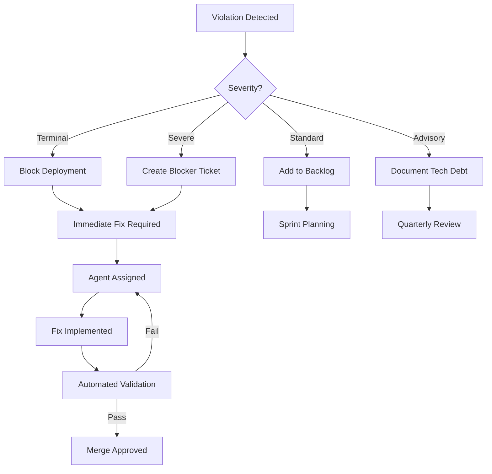

/**
 * Path: /KINETIK-OS-PROJECT-RULES.md
 * Filename: KINETIK-OS-PROJECT-RULES.md | Version: v7.8.3
 * Agent: Kinetik-OS (Lead: Security-S / Architect-K / DevOps-V)
 * Status: PRODUCTION CANONICAL
 * Logic: Absolute operational constraints, enforcement protocols, and quality standards
 */

# KINETIK-OS PROJECT RULES

**Version:** 7.8.3  
**Project:** Westport Partners - Boutique Federal Design System  
**Updated:** May 17, 2026  
**Status:** ULTRA HEAVYWEIGHT ENFORCEMENT

---

## RULE CLASSIFICATION SYSTEM

Rules are classified by severity and enforcement level:

| Classification | Symbol | Enforcement | Consequence of Violation |
|----------------|--------|-------------|--------------------------|
| **Terminal** | ❌ | Automated + Manual | Project halt, rollback required |
| **Severe** | ⚠️ | Automated + Manual | Immediate remediation required |
| **Standard** | ✅ | Automated | Fix required before merge |
| **Advisory** | 💡 | Manual review | Document justification if violated |

---

## SECTION 1: TERMINAL RULES (PROJECT HALT)

These violations result in immediate project termination until resolved.

### ❌ RULE 1.1: THE MANDATORY HEADER RULE

**Enforcement:** Automated (pre-commit hook) + Manual review

**Statement:**  
EVERY file (PHP, YAML, CSS, JS, Markdown, JSON, HTML) MUST begin with the standardized header comment block.

**Required Format:**

```
/**
 * Path: [absolute_path_from_root]
 * Filename: [filename.ext] | Version: [vX.X.X]
 * Agent: [Architect-K/DevOps-V/Motion-G/Logic-A/DX-Curator/Security-S/Content-C/Performance-P]
 * Status: [Draft/Review/Production]
 * Logic: [Granular description of purpose and functionality]
 */
```

**Validation Criteria:**
- ✅ Header starts on line 1
- ✅ All five fields present (Path, Filename, Agent, Status, Logic)
- ✅ Version follows semantic versioning (vX.X.X)
- ✅ Agent ID matches approved list (Architect-K, DevOps-V, Motion-G, Logic-A, DX-Curator, Security-S, Content-C, Performance-P)
- ✅ Status is one of: Draft, Review, Production

**Automated Check:**
```bash
#!/bin/bash
# .git/hooks/pre-commit

FILES=$(git diff --cached --name-only --diff-filter=ACM | grep -E '\.(php|yaml|yml|css|js|md)$')

for FILE in $FILES; do
  if ! head -n 8 "$FILE" | grep -q "Path:.*Filename:.*Agent:.*Status:.*Logic:"; then
    echo "❌ TERMINAL VIOLATION: Missing header in $FILE"
    exit 1
  fi
done
```

**Consequence of Violation:**
- Commit rejected
- CI/CD pipeline fails
- Manual code review required before bypass

---

### ❌ RULE 1.2: ZERO-DATABASE LAW

**Enforcement:** Automated (code scanning) + Manual review

**Statement:**  
NO database code, configuration, or references are permitted anywhere in the codebase. This includes MySQL, PostgreSQL, SQLite, MongoDB, Redis, or any persistent data storage system except flat files.

**Prohibited Terms (Case-Insensitive):**
- `mysql`, `mysqli`, `pdo`, `sqlite`, `postgres`, `mongodb`
- `redis`, `memcached`, `database`, `db_`, `SQL`
- `CREATE TABLE`, `INSERT INTO`, `SELECT FROM`
- `doctrine`, `eloquent`, `active record`

**Exceptions:**
- Comments explaining why databases are NOT used
- Documentation referencing database-free architecture
- Variable names like `$isDatabase = false;` (with clear intent)

**Automated Check:**
```bash
#!/bin/bash
# scripts/check-database-violations.sh

VIOLATIONS=$(grep -rniE '(mysql|mysqli|pdo|sqlite|postgres|mongodb|redis|CREATE TABLE|INSERT INTO|SELECT FROM)' \
  --include=\*.php \
  --include=\*.yaml \
  --include=\*.yml \
  --exclude-dir=vendor \
  --exclude-dir=node_modules \
  .)

if [ -n "$VIOLATIONS" ]; then
  echo "❌ TERMINAL VIOLATION: Database code detected:"
  echo "$VIOLATIONS"
  exit 1
fi
```

**Consequence of Violation:**
- Immediate code removal
- Architect review of content storage strategy
- Justification required for any persistent data needs

---

### ❌ RULE 1.3: PUBLIC/PRIVATE VAULT SOVEREIGNTY

**Enforcement:** Automated (directory structure validation) + Manual review

**Statement:**  
The `/public` directory is the ONLY web-accessible folder. ALL application code, content, and configuration MUST reside above the web root in private directories.

**Public Folder (Web Accessible):**
```
/public/
├── index.php          ✅ ONLY Kirby bootstrap
├── .htaccess          ✅ ONLY security rules
├── robots.txt         ✅ ONLY search engine directives
├── dist/              ✅ ONLY Vite build output
└── media/             ✅ ONLY Kirby processed media
```

**Prohibited in Public:**
- ❌ PHP templates or snippets
- ❌ Kirby blueprints or config files
- ❌ Raw source files (main.js, index.css)
- ❌ Content files (.txt, .md)
- ❌ Composer vendor directory
- ❌ Node modules

**Automated Check:**
```bash
#!/bin/bash
# scripts/check-public-directory.sh

VIOLATIONS=$(find public/ -type f \
  ! -name 'index.php' \
  ! -name '.htaccess' \
  ! -name 'robots.txt' \
  ! -path 'public/dist/*' \
  ! -path 'public/media/*' \
  ! -name '*.jpg' \
  ! -name '*.png' \
  ! -name '*.webp' \
  ! -name '*.svg')

if [ -n "$VIOLATIONS" ]; then
  echo "❌ TERMINAL VIOLATION: Unauthorized files in /public:"
  echo "$VIOLATIONS"
  exit 1
fi
```

**Consequence of Violation:**
- Immediate file relocation
- Security audit of entire directory structure
- AWS deployment blocked until resolved

---

### ❌ RULE 1.4: KIRBY STARTERKIT PROHIBITION (WITH WHITELIST)

**Enforcement:** Manual review + File hash validation (Skipping whitelisted files)

**Statement:**  
Except for specific whitelisted files governed by the Hybrid-Boutique Architecture, ZERO Kirby Starterkit files are permitted. All custom blueprints, templates, and snippets MUST be built from a Plainkit zero-byte baseline.

**Whitelisted Starterkit Elements (Allowed):**
- Page Models mapping to Starterkit logic (e.g., `AboutPage` to encapsulate filtering).
- Base Blueprints for SEO and metadata (`site.yml` and `files/image.yml`).
- Recursive Navigation snippets/logic (must be wrapped in Alpine.js for accessibility).

**Prohibited Files (Terminal Violation):**
- Default Starterkit global CSS/JS
- Default Starterkit content and media assets
- Default Starterkit templates and snippets (unless explicitly overridden per Hybrid block rules)

**Validation Method:**
```bash
# Generate hash of clean Plainkit installation
# Compare against project files to detect Starterkit pollution

STARTERKIT_HASHES=(
  "7f8a9b2c3d4e5f6a"  # home.php template
  # ... add known Starterkit file hashes, excluding whitelisted files like about.yml
)

for HASH in "${STARTERKIT_HASHES[@]}"; do
  FOUND=$(find site/ -type f -exec md5sum {} \; | grep "$HASH")
  if [ -n "$FOUND" ]; then
    echo "❌ TERMINAL VIOLATION: Non-whitelisted Starterkit file detected"
    exit 1
  fi
done
```

**Consequence of Violation:**
- File removal
- Rebuild from Plainkit baseline
- Documentation update on custom implementation

---

## SECTION 2: SEVERE RULES (IMMEDIATE REMEDIATION)

These violations require immediate fix but don't halt the entire project.

### ⚠️ RULE 2.1: STRICT TYPING MANDATE

**Enforcement:** Automated (PHP linting)

**Statement:**  
ALL PHP files MUST include `declare(strict_types=1);` on line 3 (after opening tag and header comment).

**Required Pattern:**
```php
<?php
// Header comment block (lines 2-8)
declare(strict_types=1);

// Rest of code
```

**Automated Check:**
```php
// .php-cs-fixer.php
<?php

$finder = PhpCsFixer\Finder::create()
    ->in(__DIR__ . '/site')
    ->name('*.php');

return (new PhpCsFixer\Config())
    ->setRules([
        'declare_strict_types' => true,
    ])
    ->setFinder($finder);
```

**Consequence of Violation:**
- Automated fix via PHP-CS-Fixer
- Manual review if auto-fix fails
- Code review approval required

---

### ⚠️ RULE 2.2: NO INLINE STYLES

**Enforcement:** Automated (template linting)

**Statement:**  
NO `style=""` attributes permitted in any template, snippet, or component. ALL styling MUST use Tailwind utility classes or @theme variables.

**Prohibited:**
```php
❌ <div style="padding-top: 4rem;">
❌ <section style="background-color: #005B6D;">
❌ <?php echo 'style="margin: 20px;"'; ?>
```

**Required:**
```php
✅ <div class="pt-airy-md">
✅ <section class="bg-oceanic-dark">
✅ <div class="<?= $block->spacing()->toAiry() ?>">
```

**Automated Check:**
```bash
# scripts/check-inline-styles.sh

VIOLATIONS=$(grep -rn 'style="' \
  --include=\*.php \
  --exclude-dir=vendor \
  site/)

if [ -n "$VIOLATIONS" ]; then
  echo "⚠️ SEVERE VIOLATION: Inline styles detected:"
  echo "$VIOLATIONS"
  exit 1
fi
```

**Consequence of Violation:**
- Convert to Tailwind utility classes
- Add missing design token if needed
- DX-Curator review for token system gaps

---

### ⚠️ RULE 2.3: CONSTRUCTOR PROPERTY PROMOTION

**Enforcement:** Manual code review

**Statement:**  
All Page Models and DTOs MUST use PHP 8.4 constructor property promotion. No traditional property declarations.

**Prohibited:**
```php
❌ class StrategyPage extends Page
{
    private string $title;
    private bool $featured;
    
    public function __construct(string $title, bool $featured)
    {
        $this->title = $title;
        $this->featured = $featured;
    }
}
```

**Required:**
```php
✅ class StrategyPage extends Page
{
    public function __construct(
        private readonly string $title,
        private readonly bool $featured = false
    ) {}
}
```

**Consequence of Violation:**
- Refactor to promoted properties
- Architect-K review for consistency
- Update documentation examples

---

### ⚠️ RULE 2.4: THE HANDSHAKE ORDER

**Enforcement:** Manual testing + Automated initialization check

**Statement:**  
Alpine.js MUST mount and initialize BEFORE GSAP animations are triggered. This prevents race conditions and ensures proper DOM state.

**Required Initialization Order:**
```javascript
// 1. Alpine initializes FIRST
import Alpine from 'alpinejs';
Alpine.start();

// 2. GSAP waits for Alpine ready event
document.addEventListener('alpine:init', () => {
  initializeGsapAnimations();
});
```

**Prohibited:**
```javascript
❌ // GSAP initializing before Alpine
import gsap from 'gsap';
gsap.from('.element', { opacity: 0 });
Alpine.start();
```

**Automated Check:**
```javascript
// src/main.js validation
if (window.gsap && !window.Alpine) {
  console.error('⚠️ SEVERE VIOLATION: GSAP loaded before Alpine');
  throw new Error('The Handshake violated: Alpine must mount first');
}
```

**Consequence of Violation:**
- Reorder script initialization
- Motion-G and Logic-A coordination review
- Test all animated components

---

## SECTION 3: STANDARD RULES (MERGE BLOCKING)

These rules are enforced by automated tooling and block merges.

### ✅ RULE 3.1: DESIGN TOKEN SOVEREIGNTY

**Enforcement:** Automated (CSS linting)

**Statement:**  
All colors, spacing, and typography MUST use predefined @theme variables. No hardcoded values.

**Required:**
```css
✅ .element { color: var(--color-oceanic-dark); }
✅ .section { padding-top: var(--spacing-airy-xl); }
✅ .heading { font-size: var(--font-size-4xl); }
```

**Prohibited:**
```css
❌ .element { color: #005B6D; }
❌ .section { padding-top: 10rem; }
❌ .heading { font-size: 36px; }
```

**Automated Check:**
```javascript
// stylelint.config.js
module.exports = {
  rules: {
    'color-no-hex': true,
    'declaration-property-value-disallowed-list': {
      '/^padding/': ['/^[0-9]/'],
      '/^margin/': ['/^[0-9]/'],
      '/^font-size/': ['/^[0-9]/'],
    }
  }
};
```

**Exceptions:**
- `0` values (e.g., `margin: 0;`)
- `1px` for hairline borders
- Documented one-off exceptions with justification

---

### ✅ RULE 3.2: BLUEPRINT VALIDATION

**Enforcement:** Automated (YAML schema validation)

**Statement:**  
All Kirby blueprints MUST pass YAML schema validation before commit.

**Validation Checks:**
- Valid YAML syntax
- Required fields present (name, fields)
- Field types match Kirby 5.4 specification
- No deprecated field types
- Proper indentation (2 spaces)

**Automated Check:**
```bash
# scripts/validate-blueprints.sh

for BLUEPRINT in site/blueprints/**/*.yml; do
  # Check YAML syntax
  yamllint "$BLUEPRINT" || exit 1
  
  # Validate against Kirby schema
  php kirby validate:blueprint "$BLUEPRINT" || exit 1
done
```

**Consequence of Violation:**
- Fix YAML syntax errors
- Update to supported field types
- Architect-K review for complex blueprints

---

### ✅ RULE 3.3: ACCESSIBILITY STANDARDS

**Enforcement:** Automated (axe-core) + Manual testing

**Statement:**  
All interactive components MUST meet WCAG 2.1 Level AA compliance.

**Required Attributes:**
```html
✅ <button aria-label="Close menu">×</button>
✅ <nav aria-label="Main navigation">
✅ 
✅ <form role="search">
```

**Prohibited:**
```html
❌ <button>×</button>  <!-- No accessible label -->
❌ <div onclick="...">  <!-- Non-semantic interactive element -->
❌   <!-- Missing alt text -->
```

**Automated Check:**
```javascript
// tests/accessibility.test.js
import { expect, test } from '@playwright/test';
import { injectAxe, checkA11y } from 'axe-playwright';

test('Homepage accessibility', async ({ page }) => {
  await page.goto('http://localhost:8000');
  await injectAxe(page);
  await checkA11y(page, null, {
    detailedReport: true,
    detailedReportOptions: { html: true }
  });
});
```

**Consequence of Violation:**
- Add missing ARIA attributes
- Replace non-semantic elements
- Logic-A review for complex interactions

---

### ✅ RULE 3.4: PERFORMANCE BUDGETS

**Enforcement:** Automated (Lighthouse CI)

**Statement:**  
All pages MUST meet minimum performance thresholds.

**Performance Targets:**

| Metric | Target | Measurement |
|--------|--------|-------------|
| Lighthouse Performance | ≥ 90 | Automated CI |
| First Contentful Paint (FCP) | < 1.8s | Lighthouse |
| Largest Contentful Paint (LCP) | < 2.5s | Lighthouse |
| Time to Interactive (TTI) | < 3.5s | Lighthouse |
| Cumulative Layout Shift (CLS) | < 0.1 | Lighthouse |
| Total Bundle Size | < 500KB | Webpack Bundle Analyzer |
| JavaScript Bundle | < 200KB | Webpack Bundle Analyzer |

**Automated Check:**
```yaml
# .github/workflows/lighthouse-ci.yml
name: Lighthouse CI
on: [push]
jobs:
  lighthouse:
    runs-on: ubuntu-latest
    steps:
      - uses: actions/checkout@v2
      - name: Run Lighthouse
        uses: treosh/lighthouse-ci-action@v9
        with:
          urls: |
            http://localhost:8000
            http://localhost:8000/about
          budgetPath: ./lighthouse-budget.json
          uploadArtifacts: true
```

**Consequence of Violation:**
- Optimize images and assets
- Code splitting for large bundles
- Performance-P escalation if target unreachable

---

### ✅ RULE 3.5: KIRBY BLOCK INTELEPHENSE DOCUMENTATION

**Enforcement:** Automated (PHP linting) + Manual review

**Statement:**  
All Kirby block snippets MUST include a PHPDoc variable declaration for `$block` to prevent false positive "Undefined variable" errors in static analysis tools like Intelephense.

**Required:**
```php
<?php
/**
 * Path: /site/snippets/blocks/example.php
 * Filename: example.php | Version: v1.0.0
 * Agent: Architect-K
 * Status: Production
 * Logic: Example block rendering
 * 
 * @var \Kirby\Cms\Block $block
 */
?>
```

**Prohibited:**
```php
❌ // Missing @var declaration
<?php
$title = $block->title();
?>
```

**Consequence of Violation:**
- Add PHPDoc type hint
- Editor/Linting errors unresolved

---

### ✅ RULE 3.6: PHASE SUMMARIES TRACKING

**Enforcement:** Manual review + Automated check (if applicable)

**Statement:**  
All phase summary markdown files (e.g., in `docs/phase-summaries/`) MUST include a date and version at the top. When these files are updated or appended, the version MUST be incremented, the date updated, and a clear changelog or description of what changes were made must be appended. This ensures accurate tracking of how many times an individual task was worked on.

**Required Format:**
```markdown
# [Phase Summary Title]

**Date:** [YYYY-MM-DD]  
**Version:** [vX.X.X]

## Changelog
- **[vX.X.X]** ([YYYY-MM-DD]): Initial summary created.
- **[vX.X.Y]** ([YYYY-MM-DD]): Appended [specific changes or fixes].
```

**Consequence of Violation:**
- Update rejected
- Architect-K review for proper documentation and tracking

---

### ✅ RULE 3.7: ROO TASK ARCHIVING WORKFLOW

**Enforcement:** Manual (Agent execution upon request)

**Statement:**  
To prevent memory constraints while preserving operational history across container rebuilds, the project maintains two distinct directories for Roo tasks:
- `.roo-tasks/`: The active directory for persistent task state.
- `.roo-tasks-archive/`: The archive directory for completed tasks.

When the user requests to "archive tasks" (e.g., "Archive my roo tasks" or "Archive all but 2 of the latest roo tasks"), the agent MUST:
1. Access the `.roo-tasks/tasks/` directory.
2. Sort all task folders by their modification/creation date.
3. Preserve the 2 most recent task folders exactly where they are.
4. Move all older, remaining task folders into `.roo-tasks-archive/tasks/` (creating the directory if it doesn't exist).
5. (Optional but recommended) Update `.roo-tasks/tasks/_index.json` or inform the user that Roo will rebuild the index automatically when reloaded.

**Consequence of Violation:**
- Task history clutter
- Context window and memory bloat
- Workspace performance degradation

### ✅ RULE 3.8: RESPONSIVE IMAGE ENFORCEMENT

**Enforcement:** Manual Review + Automated (template linting)

**Statement:**  
All static images rendered in templates or snippets MUST utilize the central `snippet('image', ...)` component to ensure automatic WebP conversion and responsive `srcset` generation. Direct `` tags for standard media files are prohibited to maintain performance budgets.

**Required:**
```php
✅ <?php snippet('image', ['file' => $image, 'class' => 'w-full']) ?>
```

**Prohibited:**
```php
❌ url() ?>" class="w-full">
```

**Exceptions:**
- Vector graphics (`.svg` files) which handle their own scaling.
- Explicit inline data-URIs or non-file based image elements.

---

## SECTION 4: ADVISORY RULES (BEST PRACTICES)

These rules are guidelines that may be violated with documented justification.

### 💡 RULE 4.1: SEMANTIC VERSIONING

**Statement:**  
File versions SHOULD follow semantic versioning (MAJOR.MINOR.PATCH).

**Guidelines:**
- MAJOR: Breaking changes to API or structure
- MINOR: New features, backwards compatible
- PATCH: Bug fixes, documentation updates

**Example:**
```
v7.8.0 → v7.8.1  (Bug fix)
v7.8.1 → v7.9.0  (New block added)
v7.9.0 → v8.0.0  (Tailwind 4 → Tailwind 5 migration)
```

---

### 💡 RULE 4.2: COMPONENT DOCUMENTATION

**Statement:**  
All custom blocks SHOULD include inline documentation explaining usage.

**Required Documentation:**
```php
/**
 * USAGE:
 * - Add block via Panel
 * - Configure spacing, theme, heading
 * - Supports Alpine.js expand interaction
 * 
 * DEPENDENCIES:
 * - BoutiqueBridge trait
 * - Alpine.js (Logic-A)
 * 
 * ARIA:
 * - aria-expanded on interactive elements
 */
```

---

### 💡 RULE 4.3: GIT COMMIT MESSAGES

**Statement:**  
Commit messages SHOULD follow Conventional Commits format.

**Format:**
```
[AGENT-NAME] TYPE(scope): Brief description

Detailed explanation.

BREAKING CHANGE: Description of breaking change (if applicable)

Closes #123
```

**Types:**
- `FEAT`: New feature
- `FIX`: Bug fix
- `DOCS`: Documentation update
- `STYLE`: Code formatting (no logic change)
- `REFACTOR`: Code restructuring
- `PERF`: Performance improvement
- `TEST`: Test addition or update
- `CHORE`: Build process or tooling

**Examples:**
```
[Architect-K] FEAT(models): Add BoutiqueBridge trait
[DevOps-V] FIX(vite): Correct HMR polling for Rancher Desktop
[DX-Curator] DOCS(tokens): Update @theme variable reference
```

---

## SECTION 5: ENFORCEMENT MECHANISMS

### 5.1 Automated Enforcement

**Pre-Commit Hooks:**
```bash
#!/bin/bash
# .git/hooks/pre-commit

echo "Running pre-commit checks..."

# Check 1: File headers
./scripts/check-file-headers.sh || exit 1

# Check 2: Database violations
./scripts/check-database-violations.sh || exit 1

# Check 3: Inline styles
./scripts/check-inline-styles.sh || exit 1

# Check 4: PHP strict types
vendor/bin/php-cs-fixer fix --dry-run --diff || exit 1

# Check 5: Blueprint validation
./scripts/validate-blueprints.sh || exit 1

echo "✅ All pre-commit checks passed"
```

**CI/CD Pipeline:**
```yaml
# .github/workflows/quality-gates.yml
name: Quality Gates
on: [pull_request]

jobs:
  enforce-rules:
    runs-on: ubuntu-latest
    steps:
      - uses: actions/checkout@v2
      
      - name: Terminal Rules
        run: |
          ./scripts/check-file-headers.sh
          ./scripts/check-database-violations.sh
          ./scripts/check-public-directory.sh
      
      - name: Severe Rules
        run: |
          composer install
          vendor/bin/php-cs-fixer fix --dry-run
          ./scripts/check-inline-styles.sh
      
      - name: Standard Rules
        run: |
          npm install
          npm run lint:css
          ./scripts/validate-blueprints.sh
      
      - name: Accessibility
        run: npm run test:a11y
      
      - name: Performance
        run: npm run lighthouse:ci
```

### 5.2 Manual Enforcement

**Code Review Checklist:**

```markdown
## Code Review Checklist

### Terminal Rules
- [ ] All files have mandatory headers
- [ ] No database code present
- [ ] Public/private vault structure intact
- [ ] No Starterkit files detected

### Severe Rules
- [ ] Strict typing enabled in all PHP files
- [ ] No inline styles in templates
- [ ] Constructor property promotion used
- [ ] The Handshake order correct (Alpine → GSAP)

### Standard Rules
- [ ] Design tokens used exclusively
- [ ] Blueprints validated
- [ ] WCAG 2.1 AA compliance
- [ ] Performance budgets met

### Advisory Rules
- [ ] Semantic versioning followed
- [ ] Component documentation present
- [ ] Commit messages follow convention

**Reviewer:** [Name]  
**Date:** [YYYY-MM-DD]  
**Agent Sign-Off:** [AGENT-IDs]
```

### 5.3 Exception Protocol

**Requesting Rule Exception:**

1. Create exception request document
2. Document business justification
3. Propose alternative solution
4. Get approval from relevant agents
5. Add exception to `.rule-exceptions.yml`

**Exception Template:**
```yaml
# .rule-exceptions.yml
exceptions:
  - rule_id: 3.1
    file: site/snippets/special-case.php
    justification: "Third-party widget requires inline styles"
    approved_by: [DX-C, SEC-S]
    approved_date: 2026-05-04
    expiry_date: 2026-08-04
    alternative: "Isolate in iframe with sandbox attribute"
```

---

## SECTION 6: RULE VIOLATION RESPONSE

### 6.1 Severity-Based Response

| Severity | Detection | Response Time | Action |
|----------|-----------|---------------|--------|
| Terminal | Automated | Immediate | Block commit, halt CI/CD |
| Severe | Automated | < 1 hour | Create blocker ticket, assign agent |
| Standard | Automated | < 24 hours | Add to sprint backlog |
| Advisory | Manual | Next sprint | Document in tech debt log |

### 6.2 Violation Tracking

**Violation Log Format:**
```json
{
  "violation_id": "V-2026-05-04-001",
  "rule_id": "1.2",
  "severity": "terminal",
  "file": "site/models/legacy.php",
  "line": 42,
  "detected_by": "automated",
  "detected_at": "2026-05-04T14:23:00Z",
  "assigned_to": "ARCH-K",
  "status": "resolved",
  "resolution": "Removed PDO reference, migrated to flat-file",
  "resolved_at": "2026-05-04T15:10:00Z"
}
```

### 6.3 Remediation Workflow



---

## SECTION 7: RULE MAINTENANCE

### 7.1 Rule Update Protocol

**Adding New Rules:**
1. Draft rule with justification
2. Classify severity (Terminal/Severe/Standard/Advisory)
3. Define automated check (if applicable)
4. Get approval from affected agents
5. Update documentation
6. Implement enforcement
7. Communicate to team

**Modifying Existing Rules:**
1. Document reason for change
2. Assess impact on existing code
3. Create migration plan if needed
4. Get approval from all agents
5. Update enforcement scripts
6. Announce change with grace period

**Deprecating Rules:**
1. Mark as deprecated with effective date
2. Document replacement rule (if applicable)
3. Grace period (minimum 30 days)
4. Remove from automated enforcement
5. Archive in rule history

### 7.2 Rule Review Schedule

| Frequency | Scope | Owner |
|-----------|-------|-------|
| Weekly | Violation metrics review | DevOps-V |
| Monthly | Rule effectiveness analysis | All Agents |
| Quarterly | Full rule audit and optimization | Security-S + Architect-K |
| Annual | Major revision and consolidation | All Agents |

---

## SECTION 8: RULE EXCEPTIONS LOG

**Current Active Exceptions:**

```yaml
# No active exceptions as of v7.8.0
# All code adheres to canonical ruleset
exceptions: []
```

**Historical Exceptions:**

```yaml
# Template for documenting resolved exceptions
historical_exceptions:
  - rule_id: 2.2
    reason: "Initial migration had legacy inline styles"
    resolved: 2026-04-15
    resolution: "Converted all to Tailwind utilities"
```

---

## APPENDIX A: RULE QUICK REFERENCE

### Terminal Rules (❌)
1. **Mandatory Headers** - All files must have standardized headers
2. **Zero Database** - No database code permitted
3. **Public/Private Vault** - Only index.php, .htaccess, dist/, media/ in public
4. **No Starterkit** - Plainkit baseline only

### Severe Rules (⚠️)
1. **Strict Typing** - `declare(strict_types=1);` required
2. **No Inline Styles** - Use Tailwind utilities only
3. **Constructor Promotion** - Use PHP 8.4 promoted properties
4. **The Handshake** - Alpine before GSAP

### Standard Rules (✅)
1. **Design Tokens** - Use @theme variables only
2. **Blueprint Validation** - YAML schema compliance
3. **Accessibility** - WCAG 2.1 AA compliance
4. **Performance Budgets** - Lighthouse score ≥ 90
5. **Phase Summaries Tracking** - Phase summaries must have date/version and changelog on updates
6. **Roo Task Archiving** - Keep 2 latest tasks in active folder, archive the rest
7. **Responsive Image Enforcement** - All static images must use the `snippet('image', ...)` helper

### Advisory Rules (💡)
1. **Semantic Versioning** - Follow MAJOR.MINOR.PATCH
2. **Documentation** - Inline docs for components
3. **Commit Messages** - Conventional Commits format

---

## APPENDIX B: ENFORCEMENT SCRIPT TEMPLATES

### Template 1: File Header Checker

```bash
#!/bin/bash
# scripts/check-file-headers.sh

MISSING_HEADERS=()

while IFS= read -r -d '' FILE; do
  if ! head -n 8 "$FILE" | grep -q "Path:.*Filename:.*Agent:.*Status:.*Logic:"; then
    MISSING_HEADERS+=("$FILE")
  fi
done < <(find site/ -type f \( -name "*.php" -o -name "*.yml" \) -print0)

if [ ${#MISSING_HEADERS[@]} -gt 0 ]; then
  echo "❌ TERMINAL VIOLATION: Missing headers in:"
  printf '%s\n' "${MISSING_HEADERS[@]}"
  exit 1
fi

echo "✅ All files have valid headers"
```

### Template 2: Design Token Validator

```javascript
// scripts/validate-design-tokens.js
const fs = require('fs');
const path = require('path');

const ALLOWED_HARDCODED = ['0', '1px'];
const HARDCODED_PATTERN = /(?:padding|margin|font-size|color):\s*([0-9]+(?:px|rem|em)|#[0-9a-fA-F]{3,6})/g;

function checkFile(filePath) {
  const content = fs.readFileSync(filePath, 'utf8');
  const violations = [];
  
  let match;
  while ((match = HARDCODED_PATTERN.exec(content)) !== null) {
    const value = match[1];
    if (!ALLOWED_HARDCODED.includes(value)) {
      violations.push({
        file: filePath,
        line: content.substring(0, match.index).split('\n').length,
        value: value
      });
    }
  }
  
  return violations;
}

// Run check on all CSS/PHP files
const violations = [];
// ... implementation

if (violations.length > 0) {
  console.error('⚠️ SEVERE VIOLATION: Hardcoded values detected');
  console.table(violations);
  process.exit(1);
}
```

---

**END OF PROJECT RULES DOCUMENT**

**Version History:**
- v7.8.3 (2026-05-17): Added RULE 3.8 Responsive Image Enforcement
- v7.8.2 (2026-05-16): Added RULE 3.7 Roo Task Archiving Workflow
- v7.8.1 (2026-05-16): Added RULE 3.6 Phase Summaries Tracking
- v7.8.0 (2026-05-04): Initial consolidated ruleset
- Future versions will be documented here

**Next Review Date:** 2026-06-04

**Rule Custodians:**
- Terminal Rules: Security-S + Architect-K
- Severe Rules: Architect-K + DX-Curator
- Standard Rules: All Agents
- Advisory Rules: DX-Curator
